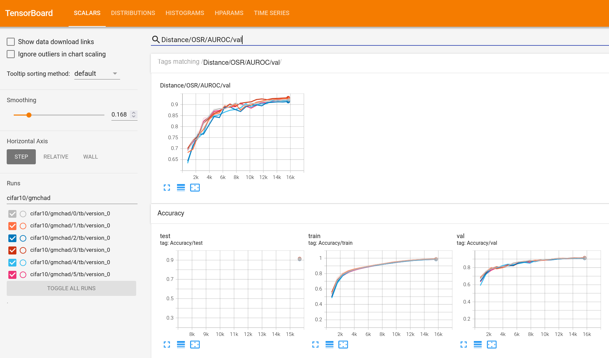

<div align="center">

# Multi-Class Hypersphere Anomaly Detection

<a href="https://pytorch.org/get-started/locally/"></a>
<a href="https://pytorchlightning.ai/"></a>
<a href="https://hydra.cc/"></a>
<a href="https://github.com/ashleve/lightning-hydra-template"></a><br>

<a href="https://github.com/ashleve/lightning-hydra-template"></a><br>


This Repository contains the source code for the paper _Multi-Class Hypersphere Anomaly Detection_.


</div>

## Setup
This repository is a fork of the
[lightning-hydra-template](https://github.com/ashleve/lightning-hydra-template), so you might
want to read their excellent instructions on how to use this software stack.

First, create a python virtual environment, install dependencies, and
add the `src`  directory to your python path.

```
python -m virtualenv venv
source venv/bin/activate
pip install -r requirements.txt
export PYTHONPATH="src/"
```

## Usage

Experiments are defined in `config/experiments`.
To run MCHAD on CIFAR10 run:

```
python run.py experiment=cifar10-mchad
```

Each experiment will create a `results.csv` file that contains metrics for all datasets, as
well as a CSV log of the metrics during training, and a TensorBoard log.

### Override Configuration
You can override configuration parameters via the command line, such as:
```shell
python run.py experiment=cifar10-mchad trainer.gpus=1
```
to train on the GPU.

### Seed Replicates
You can run experiments for multiple random seeds in parallel with hydra sweeps:
```shell
python run.py -m experiment=cifar10-mchad trainer.gpus=1 seed="range(1,21)"
```
We configured the Ray Launcher for parallelization.
Per default, we run experiments in parallel on 6 GPUs.
You might have to adjust `config/hydra/launcher/ray.yaml`.

<details>
<summary><b>Live training metrics, embeddings etc. can be visualized with Tensorboard.</b></summary>

```shell
tensorboard --logdir logs/
```



</details>


## Replication

Pre-Trained Weights used for models: 
```text
wget https://github.com/hendrycks/pre-training/raw/master/uncertainty/CIFAR/snapshots/imagenet/cifar10_excluded/imagenet_wrn_baseline_epoch_99.pt
++model.pretrained_checkpoint='${data_dir}/imagenet_wrn_baseline_epoch_99.pt'
```

Experiments can be replicated by running `bash/run-rexperiments.sh`,
which also accepts command line overrides, such as:
```
bash/run-rexperiments.sh dataset_dir=/path/to/your/dataset/directory/
```

All datasets will be downloaded automatically to the given `dataset_dir`.

Results for each run will be written to `csv` files which have to be aggregated.
You can find the scripts in `notebooks/eval.ipynb`.

### Ablations

To replicate the ablation experiments, run:
```shell
bash/run-ablation.sh dataset_dir=/path/to/your/dataset/directory/
```

## Results

We average all results over 6 seed replicates and several benchmark outlier datasets.


<table border="1" class="dataframe">
  <thead>
    <tr>
      <th></th>
      <th></th>
      <th colspan="2" halign="left">Accuracy</th>
      <th colspan="2" halign="left">AUROC</th>
      <th colspan="2" halign="left">AUPR-IN</th>
      <th colspan="2" halign="left">AUPR-OUT</th>
      <th colspan="2" halign="left">FPR95</th>
    </tr>
    <tr>
      <th></th>
      <th></th>
      <th>mean</th>
      <th>std</th>
      <th>mean</th>
      <th>std</th>
      <th>mean</th>
      <th>std</th>
      <th>mean</th>
      <th>std</th>
      <th>mean</th>
      <th>std</th>
    </tr>
    <tr>
      <th>Dataset</th>
      <th>Model</th>
      <th></th>
      <th></th>
      <th></th>
      <th></th>
      <th></th>
      <th></th>
      <th></th>
      <th></th>
      <th></th>
      <th></th>
    </tr>
  </thead>
  <tbody>
    <tr>
      <th rowspan="7" valign="top">CIFAR10</th>
      <th>CAC</th>
      <td>93.55</td>
      <td>0.14</td>
      <td>80.35</td>
      <td>8.75</td>
      <td>75.88</td>
      <td>12.08</td>
      <td>79.07</td>
      <td>8.83</td>
      <td>61.18</td>
      <td>16.99</td>
    </tr>
    <tr>
      <th>Center</th>
      <td>93.32</td>
      <td>0.20</td>
      <td>87.43</td>
      <td>8.35</td>
      <td>87.71</td>
      <td>9.26</td>
      <td>83.93</td>
      <td>10.26</td>
      <td>56.98</td>
      <td>17.78</td>
    </tr>
    <tr>
      <th>G-CAC</th>
      <td>93.34</td>
      <td>0.20</td>
      <td>84.49</td>
      <td>17.61</td>
      <td>86.09</td>
      <td>16.97</td>
      <td>80.41</td>
      <td>20.31</td>
      <td>47.81</td>
      <td>38.62</td>
    </tr>
    <tr>
      <th>G-Center</th>
      <td>93.00</td>
      <td>0.18</td>
      <td>82.47</td>
      <td>18.09</td>
      <td>83.12</td>
      <td>15.02</td>
      <td>80.00</td>
      <td>15.04</td>
      <td>61.39</td>
      <td>20.59</td>
    </tr>
    <tr>
      <th>G-MCHAD</th>
      <td>93.41</td>
      <td>0.25</td>
      <td>87.95</td>
      <td>6.90</td>
      <td>87.27</td>
      <td>9.74</td>
      <td>84.17</td>
      <td>8.23</td>
      <td>53.92</td>
      <td>23.00</td>
    </tr>
    <tr>
      <th>II</th>
      <td>53.49</td>
      <td>4.18</td>
      <td>45.34</td>
      <td>13.04</td>
      <td>53.08</td>
      <td>12.82</td>
      <td>43.86</td>
      <td>5.96</td>
      <td>97.76</td>
      <td>3.22</td>
    </tr>
    <tr>
      <th>MCHAD</th>
      <td>93.69</td>
      <td>0.21</td>
      <td>89.11</td>
      <td>6.08</td>
      <td>90.53</td>
      <td>5.11</td>
      <td>85.18</td>
      <td>9.31</td>
      <td>52.35</td>
      <td>23.20</td>
    </tr>
    <tr>
      <th rowspan="6" valign="top">CIFAR100</th>
      <th>CAC</th>
      <td>71.04</td>
      <td>0.39</td>
      <td>72.07</td>
      <td>12.81</td>
      <td>74.37</td>
      <td>13.37</td>
      <td>67.36</td>
      <td>13.31</td>
      <td>79.96</td>
      <td>21.68</td>
    </tr>
    <tr>
      <th>G-CAC</th>
      <td>70.10</td>
      <td>0.47</td>
      <td>50.54</td>
      <td>31.25</td>
      <td>58.26</td>
      <td>22.45</td>
      <td>55.34</td>
      <td>20.41</td>
      <td>83.62</td>
      <td>21.89</td>
    </tr>
    <tr>
      <th>G-Center</th>
      <td>69.78</td>
      <td>0.45</td>
      <td>65.87</td>
      <td>23.31</td>
      <td>72.84</td>
      <td>16.16</td>
      <td>64.04</td>
      <td>17.92</td>
      <td>80.71</td>
      <td>15.82</td>
    </tr>
    <tr>
      <th>G-MCHAD</th>
      <td>69.95</td>
      <td>0.43</td>
      <td>72.37</td>
      <td>14.10</td>
      <td>79.01</td>
      <td>10.75</td>
      <td>65.04</td>
      <td>14.03</td>
      <td>82.10</td>
      <td>26.19</td>
    </tr>
    <tr>
      <th>II</th>
      <td>7.82</td>
      <td>0.64</td>
      <td>49.42</td>
      <td>11.24</td>
      <td>53.98</td>
      <td>11.37</td>
      <td>47.43</td>
      <td>8.00</td>
      <td>95.46</td>
      <td>3.99</td>
    </tr>
    <tr>
      <th>MCHAD</th>
      <td>70.51</td>
      <td>0.31</td>
      <td>76.80</td>
      <td>12.20</td>
      <td>82.38</td>
      <td>9.29</td>
      <td>69.56</td>
      <td>14.24</td>
      <td>76.64</td>
      <td>31.39</td>
    </tr>
    <tr>
      <th rowspan="6" valign="top">SVHN</th>
      <th>CAC</th>
      <td>96.69</td>
      <td>0.08</td>
      <td>91.10</td>
      <td>3.09</td>
      <td>92.45</td>
      <td>3.18</td>
      <td>84.18</td>
      <td>4.62</td>
      <td>19.66</td>
      <td>6.55</td>
    </tr>
    <tr>
      <th>Center</th>
      <td>94.93</td>
      <td>0.19</td>
      <td>97.54</td>
      <td>1.25</td>
      <td>99.13</td>
      <td>0.44</td>
      <td>92.78</td>
      <td>4.08</td>
      <td>15.34</td>
      <td>8.58</td>
    </tr>
    <tr>
      <th>G-CAC</th>
      <td>96.42</td>
      <td>0.14</td>
      <td>97.51</td>
      <td>4.10</td>
      <td>97.87</td>
      <td>3.56</td>
      <td>95.47</td>
      <td>7.48</td>
      <td>7.41</td>
      <td>12.03</td>
    </tr>
    <tr>
      <th>G-Center</th>
      <td>96.36</td>
      <td>0.13</td>
      <td>94.75</td>
      <td>2.31</td>
      <td>96.95</td>
      <td>1.79</td>
      <td>86.68</td>
      <td>5.56</td>
      <td>24.58</td>
      <td>7.87</td>
    </tr>
    <tr>
      <th>G-MCHAD</th>
      <td>96.33</td>
      <td>0.13</td>
      <td>98.32</td>
      <td>1.26</td>
      <td>99.42</td>
      <td>0.48</td>
      <td>93.94</td>
      <td>4.63</td>
      <td>8.61</td>
      <td>8.25</td>
    </tr>
    <tr>
      <th>II</th>
      <td>16.33</td>
      <td>7.75</td>
      <td>50.96</td>
      <td>17.96</td>
      <td>74.92</td>
      <td>11.15</td>
      <td>30.83</td>
      <td>15.43</td>
      <td>90.98</td>
      <td>15.15</td>
    </tr>
  </tbody>
</table>


<table border="1" class="dataframe">
  <thead>
    <tr>
      <th></th>
      <th></th>
      <th colspan="2" halign="left">Accuracy</th>
      <th colspan="2" halign="left">AUROC</th>
      <th colspan="2" halign="left">AUPR-IN</th>
      <th colspan="2" halign="left">AUPR-OUT</th>
      <th colspan="2" halign="left">FPR95</th>
    </tr>
    <tr>
      <th></th>
      <th></th>
      <th>mean</th>
      <th>std</th>
      <th>mean</th>
      <th>std</th>
      <th>mean</th>
      <th>std</th>
      <th>mean</th>
      <th>std</th>
      <th>mean</th>
      <th>std</th>
    </tr>
    <tr>
      <th>Dataset</th>
      <th>Model</th>
      <th></th>
      <th></th>
      <th></th>
      <th></th>
      <th></th>
      <th></th>
      <th></th>
      <th></th>
      <th></th>
      <th></th>
    </tr>
  </thead>
  <tbody>
    <tr>
      <th rowspan="4" valign="top">CIFAR10</th>
      <th>G-CAC</th>
      <td>93.34</td>
      <td>0.20</td>
      <td>84.49</td>
      <td>17.61</td>
      <td>86.09</td>
      <td>16.97</td>
      <td>80.41</td>
      <td>20.31</td>
      <td>47.81</td>
      <td>38.62</td>
    </tr>
    <tr>
      <th>G-Center</th>
      <td>93.00</td>
      <td>0.18</td>
      <td>82.47</td>
      <td>18.09</td>
      <td>83.12</td>
      <td>15.02</td>
      <td>80.00</td>
      <td>15.04</td>
      <td>61.39</td>
      <td>20.59</td>
    </tr>
    <tr>
      <th>G-MCHAD</th>
      <td>93.41</td>
      <td>0.25</td>
      <td>87.95</td>
      <td>6.90</td>
      <td>87.27</td>
      <td>9.74</td>
      <td>84.17</td>
      <td>8.23</td>
      <td>53.92</td>
      <td>23.00</td>
    </tr>
    <tr>
      <th>MCHAD</th>
      <td>93.69</td>
      <td>0.21</td>
      <td>89.11</td>
      <td>6.08</td>
      <td>90.53</td>
      <td>5.11</td>
      <td>85.18</td>
      <td>9.31</td>
      <td>52.35</td>
      <td>23.20</td>
    </tr>
    <tr>
      <th rowspan="4" valign="top">CIFAR100</th>
      <th>G-CAC</th>
      <td>70.10</td>
      <td>0.47</td>
      <td>50.54</td>
      <td>31.25</td>
      <td>58.26</td>
      <td>22.45</td>
      <td>55.34</td>
      <td>20.41</td>
      <td>83.62</td>
      <td>21.89</td>
    </tr>
    <tr>
      <th>G-Center</th>
      <td>69.78</td>
      <td>0.45</td>
      <td>65.87</td>
      <td>23.31</td>
      <td>72.84</td>
      <td>16.16</td>
      <td>64.04</td>
      <td>17.92</td>
      <td>80.71</td>
      <td>15.82</td>
    </tr>
    <tr>
      <th>G-MCHAD</th>
      <td>69.95</td>
      <td>0.43</td>
      <td>72.37</td>
      <td>14.10</td>
      <td>79.01</td>
      <td>10.75</td>
      <td>65.04</td>
      <td>14.03</td>
      <td>82.10</td>
      <td>26.19</td>
    </tr>
    <tr>
      <th>MCHAD</th>
      <td>70.51</td>
      <td>0.31</td>
      <td>76.80</td>
      <td>12.20</td>
      <td>82.38</td>
      <td>9.29</td>
      <td>69.56</td>
      <td>14.24</td>
      <td>76.64</td>
      <td>31.39</td>
    </tr>
    <tr>
      <th rowspan="3" valign="top">SVHN</th>
      <th>G-CAC</th>
      <td>96.42</td>
      <td>0.14</td>
      <td>97.51</td>
      <td>4.10</td>
      <td>97.87</td>
      <td>3.56</td>
      <td>95.47</td>
      <td>7.48</td>
      <td>7.41</td>
      <td>12.03</td>
    </tr>
    <tr>
      <th>G-Center</th>
      <td>96.36</td>
      <td>0.13</td>
      <td>94.75</td>
      <td>2.31</td>
      <td>96.95</td>
      <td>1.79</td>
      <td>86.68</td>
      <td>5.56</td>
      <td>24.58</td>
      <td>7.87</td>
    </tr>
    <tr>
      <th>G-MCHAD</th>
      <td>96.33</td>
      <td>0.13</td>
      <td>98.32</td>
      <td>1.26</td>
      <td>99.42</td>
      <td>0.48</td>
      <td>93.94</td>
      <td>4.63</td>
      <td>8.61</td>
      <td>8.25</td>
    </tr>
  </tbody>
</table>


<details>
<summary><b>SVHN</b></summary>


</details>

<details>
<summary><b>CIFAR10</b></summary>


</details>


<details>
<summary><b>CIFAR100</b></summary>


</details>

## Representation Visualization

### MCHAD
```sh
experiment=svhn-mchad trainer.gpus=1 model.weight_center=10.0 trainer.min_epochs=100 model.n_embedding=2
```


### G-MCHAD

```sh
experiment=svhn-gmchad trainer.gpus=1 model.weight_center=10.0 trainer.min_epochs=100  model.n_embedding=2
```


## Citation

```text
{

}
```
