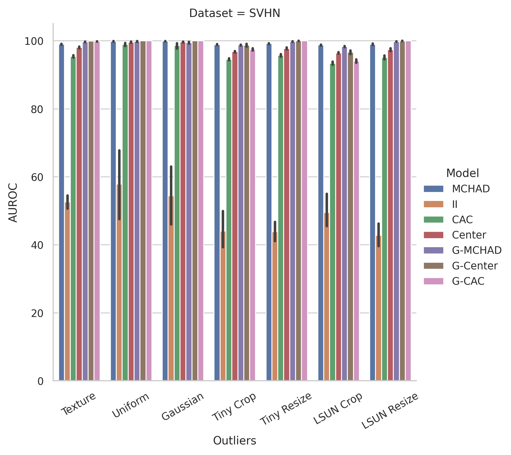

<div align="center">

# Multi-Class Hypersphere Anomaly Detection

<a href="https://ieeexplore.ieee.org/abstract/document/9956337">
    
</a>
<a href="https://github.com/kkirchheim/pytorch-ood">
    
</a>
<a href="https://pytorch.org/get-started/locally/">
    
</a>
<a href="https://pytorchlightning.ai/">
    
</a>
<a href="https://hydra.cc/">
    
</a>
<a href="https://github.com/ashleve/lightning-hydra-template">
    
</a>


This Repository contains the source code for the paper _Multi-Class Hypersphere Anomaly Detection_ as
presented at ICPR 2022.

You can find a minimal example [here](https://pytorch-ood.readthedocs.io/en/latest/auto_examples/loss/supervised/mchad.html#sphx-glr-auto-examples-loss-supervised-mchad-py). 


</div>

## Setup
This repository is a fork of the
[lightning-hydra-template](https://github.com/ashleve/lightning-hydra-template), so you might
want to read their excellent instructions on how to use this software stack.
Most of the implemented methods and datasets are taken from [pytorch-ood](https://gitlab.com/kkirchheim/pytorch-ood).

```
# setup environment
conda env create --name mchad -f environment.yaml
conda activate mchad

# these would lead to conflicts or have been installed later
pip install aiohttp==3.7 async-timeout==3.0.1 tensorboardX==2.5.1
```

## Usage

Experiments are defined in `config/experiments`.
To run MCHAD on CIFAR10 run:

```
python run.py experiment=cifar10-mchad
```

Each experiment will create a `results.csv` file that contains metrics for all datasets, as
well as a CSV log of the metrics during training, and a TensorBoard log.

### Override Configuration
You can override configuration parameters via the command line, such as:
```shell
python run.py experiment=cifar10-mchad trainer.gpus=1
```
to train on the GPU.

### Seed Replicates
You can run experiments for multiple random seeds in parallel with hydra sweeps:
```shell
python run.py -m experiment=cifar10-mchad trainer.gpus=1 seed="range(1,22)"
```
We configured the Ray Launcher for parallelization.
Per default, we run experiments in parallel on 21 GPUs.
You might have to adjust `config/hydra/launcher/ray.yaml`.

### Visualize Embeddings
To visualize the embeddings of MCHAD, you can use the following callback:
```shell
python run.py experiment=cifar10-gmchad callbacks=mchad_embeds.yaml
```
This callback will save the embeddings to the tensorboard in TSV format. 

## Replication

Download Pre-Trained Weights used for models:
```sh
wget -P data "https://github.com/hendrycks/pre-training/raw/master/uncertainty/CIFAR/snapshots/imagenet/cifar10_excluded/imagenet_wrn_baseline_epoch_99.pt"
```

Experiments can be replicated by running `bash/run-rexperiments.sh`,
which also accepts command line overrides, such as:
```
bash/run-rexperiments.sh dataset_dir=/path/to/your/dataset/directory/
```

All datasets will be downloaded automatically to the given `dataset_dir`.

Results for each run will be written to `csv` files which have to be aggregated.
You can find the scripts in `notebooks/eval.ipynb`.

### Ablations

To replicate the ablation experiments, run:
```shell
bash/run-ablation.sh dataset_dir=/path/to/your/dataset/directory/
```

## Results

We average all results over 21 seed replicates and several benchmark outlier datasets.

<table border="1" class="dataframe">
  <thead>
    <tr>
      <th></th>
      <th></th>
      <th colspan="2" halign="left">Accuracy</th>
      <th colspan="2" halign="left">AUROC</th>
      <th colspan="2" halign="left">AUPR-IN</th>
      <th colspan="2" halign="left">AUPR-OUT</th>
      <th colspan="2" halign="left">FPR95</th>
    </tr>
    <tr>
      <th></th>
      <th></th>
      <th>mean</th>
      <th>sem</th>
      <th>mean</th>
      <th>sem</th>
      <th>mean</th>
      <th>sem</th>
      <th>mean</th>
      <th>sem</th>
      <th>mean</th>
      <th>sem</th>
    </tr>
    <tr>
      <th>Dataset</th>
      <th>Model</th>
      <th></th>
      <th></th>
      <th></th>
      <th></th>
      <th></th>
      <th></th>
      <th></th>
      <th></th>
      <th></th>
      <th></th>
    </tr>
  </thead>
  <tbody>
    <tr>
      <th rowspan="7" valign="top">CIFAR10</th>
      <th>CAC</th>
      <td>95.17</td>
      <td>0.01</td>
      <td>92.81</td>
      <td>0.38</td>
      <td>88.14</td>
      <td>0.77</td>
      <td>94.84</td>
      <td>0.23</td>
      <td>18.87</td>
      <td>0.76</td>
    </tr>
    <tr>
      <th>Center</th>
      <td>94.45</td>
      <td>0.01</td>
      <td>92.59</td>
      <td>0.25</td>
      <td>88.93</td>
      <td>0.36</td>
      <td>92.66</td>
      <td>0.38</td>
      <td>29.75</td>
      <td>1.58</td>
    </tr>
    <tr>
      <th>G-CAC</th>
      <td>94.98</td>
      <td>0.03</td>
      <td>93.33</td>
      <td>0.59</td>
      <td>90.33</td>
      <td>0.72</td>
      <td>94.78</td>
      <td>0.42</td>
      <td>19.95</td>
      <td>1.18</td>
    </tr>
    <tr>
      <th>G-Center</th>
      <td>94.28</td>
      <td>0.02</td>
      <td>93.29</td>
      <td>0.51</td>
      <td>89.27</td>
      <td>0.83</td>
      <td>94.77</td>
      <td>0.40</td>
      <td>19.19</td>
      <td>1.19</td>
    </tr>
    <tr>
      <th>G-MCHAD</th>
      <td>94.69</td>
      <td>0.01</td>
      <td>96.69</td>
      <td>0.19</td>
      <td>94.31</td>
      <td>0.40</td>
      <td>97.57</td>
      <td>0.13</td>
      <td>10.27</td>
      <td>0.52</td>
    </tr>
    <tr>
      <th>II</th>
      <td>28.41</td>
      <td>0.19</td>
      <td>60.83</td>
      <td>1.41</td>
      <td>59.18</td>
      <td>1.34</td>
      <td>63.24</td>
      <td>1.47</td>
      <td>78.18</td>
      <td>2.41</td>
    </tr>
    <tr>
      <th>MCHAD</th>
      <td>94.83</td>
      <td>0.02</td>
      <td>94.15</td>
      <td>0.32</td>
      <td>89.61</td>
      <td>0.65</td>
      <td>95.80</td>
      <td>0.22</td>
      <td>16.18</td>
      <td>0.80</td>
    </tr>
    <tr>
      <th rowspan="7" valign="top">CIFAR100</th>
      <th>CAC</th>
      <td>75.67</td>
      <td>0.02</td>
      <td>73.85</td>
      <td>1.12</td>
      <td>68.82</td>
      <td>1.24</td>
      <td>77.90</td>
      <td>0.97</td>
      <td>59.91</td>
      <td>1.92</td>
    </tr>
    <tr>
      <th>Center</th>
      <td>76.59</td>
      <td>0.02</td>
      <td>74.26</td>
      <td>1.41</td>
      <td>69.04</td>
      <td>1.37</td>
      <td>78.16</td>
      <td>1.25</td>
      <td>57.64</td>
      <td>2.32</td>
    </tr>
    <tr>
      <th>G-CAC</th>
      <td>69.99</td>
      <td>0.94</td>
      <td>68.67</td>
      <td>1.34</td>
      <td>64.88</td>
      <td>1.32</td>
      <td>73.20</td>
      <td>1.11</td>
      <td>66.95</td>
      <td>1.85</td>
    </tr>
    <tr>
      <th>G-Center</th>
      <td>67.94</td>
      <td>0.11</td>
      <td>69.38</td>
      <td>2.35</td>
      <td>75.34</td>
      <td>1.70</td>
      <td>69.52</td>
      <td>2.04</td>
      <td>66.75</td>
      <td>3.40</td>
    </tr>
    <tr>
      <th>G-MCHAD</th>
      <td>77.14</td>
      <td>0.02</td>
      <td>83.96</td>
      <td>0.97</td>
      <td>80.56</td>
      <td>1.03</td>
      <td>86.27</td>
      <td>0.90</td>
      <td>45.17</td>
      <td>2.38</td>
    </tr>
    <tr>
      <th>II</th>
      <td>5.90</td>
      <td>0.07</td>
      <td>51.05</td>
      <td>1.46</td>
      <td>50.56</td>
      <td>1.11</td>
      <td>55.79</td>
      <td>1.27</td>
      <td>86.72</td>
      <td>1.88</td>
    </tr>
    <tr>
      <th>MCHAD</th>
      <td>77.52</td>
      <td>0.02</td>
      <td>79.88</td>
      <td>0.97</td>
      <td>72.59</td>
      <td>1.11</td>
      <td>84.18</td>
      <td>0.81</td>
      <td>48.83</td>
      <td>2.05</td>
    </tr>
    <tr>
      <th rowspan="7" valign="top">SVHN</th>
      <th>CAC</th>
      <td>94.56</td>
      <td>0.03</td>
      <td>95.97</td>
      <td>0.18</td>
      <td>89.05</td>
      <td>0.44</td>
      <td>97.68</td>
      <td>0.14</td>
      <td>14.60</td>
      <td>1.02</td>
    </tr>
    <tr>
      <th>Center</th>
      <td>96.06</td>
      <td>0.01</td>
      <td>97.96</td>
      <td>0.11</td>
      <td>94.15</td>
      <td>0.24</td>
      <td>98.89</td>
      <td>0.08</td>
      <td>6.35</td>
      <td>0.31</td>
    </tr>
    <tr>
      <th>G-CAC</th>
      <td>94.22</td>
      <td>0.03</td>
      <td>98.77</td>
      <td>0.18</td>
      <td>97.84</td>
      <td>0.31</td>
      <td>99.12</td>
      <td>0.13</td>
      <td>5.67</td>
      <td>0.97</td>
    </tr>
    <tr>
      <th>G-Center</th>
      <td>95.87</td>
      <td>0.01</td>
      <td>99.33</td>
      <td>0.11</td>
      <td>98.29</td>
      <td>0.28</td>
      <td>99.69</td>
      <td>0.05</td>
      <td>2.60</td>
      <td>0.41</td>
    </tr>
    <tr>
      <th>G-MCHAD</th>
      <td>95.69</td>
      <td>0.01</td>
      <td>99.38</td>
      <td>0.05</td>
      <td>97.24</td>
      <td>0.24</td>
      <td>99.80</td>
      <td>0.02</td>
      <td>2.14</td>
      <td>0.18</td>
    </tr>
    <tr>
      <th>II</th>
      <td>10.59</td>
      <td>0.11</td>
      <td>49.32</td>
      <td>1.25</td>
      <td>27.95</td>
      <td>1.00</td>
      <td>74.65</td>
      <td>0.80</td>
      <td>86.42</td>
      <td>1.64</td>
    </tr>
    <tr>
      <th>MCHAD</th>
      <td>95.81</td>
      <td>0.01</td>
      <td>99.22</td>
      <td>0.04</td>
      <td>97.12</td>
      <td>0.14</td>
      <td>99.74</td>
      <td>0.02</td>
      <td>3.16</td>
      <td>0.20</td>
    </tr>
  </tbody>
</table>


<details>
<summary><b>SVHN</b></summary>



</details>

<details>
<summary><b>CIFAR10</b></summary>


</details>


<details>
<summary><b>CIFAR100</b></summary>


</details>

## Representation Visualization

### MCHAD
```sh
experiment=svhn-mchad trainer.gpus=1 model.weight_center=10.0 trainer.min_epochs=100 model.n_embedding=2
```


### G-MCHAD

```sh
experiment=svhn-gmchad trainer.gpus=1 model.weight_center=10.0 trainer.min_epochs=100  model.n_embedding=2
```


## Citation
If you use this code, please consider citing us:

```text
@article{kirchheim2022multi,
	author = {Kirchheim, Konstantin and Filax, Marco and Ortmeier, Frank},
	journal = {International Conference on Pattern Recognition},
	number = {},
	pages = {},
	publisher = {IEEE},
	title = {Multi-Class Hypersphere Anomaly Detection},
	year = {2022}
}
```
